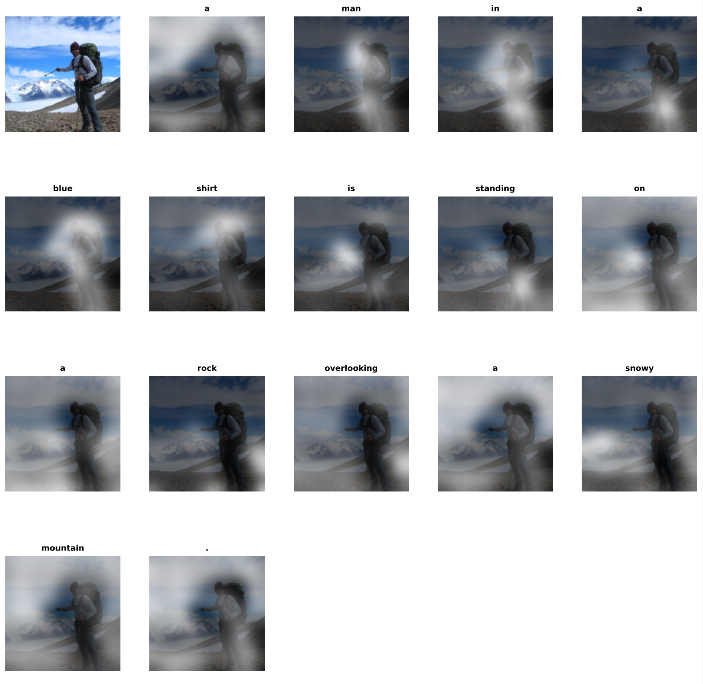

# Show, Attend, Tell

Cheryl Lam, Yanwei Liu

This repository contains a reimplementation of [Show, Attend and Tell: Neural Image Caption Generation with Visual Attention](https://arxiv.org/abs/1502.03044) (Xu et al., 2015). We reproduce both soft and hard attention variants on the Flickr8k dataset, and additionally evaluate ResNet-50 features as an alternative to the original VGG-19 encoder.

---

## Chosen Result

We reproduce **Table 1** from the original paper: BLEU-1 through BLEU-4 and METEOR scores for soft and hard attention models trained on Flickr8k. These metrics are the primary evidence in the paper that attention-based captioning outperforms non-attention baselines. We additionally compare VGG-19 vs. ResNet-50 as feature extractors to evaluate the impact of encoder representation on captioning quality.

---

## Repository Structure

```
show-attend-tell/
├── code/                  
│   ├── preprocess.py      # Data preprocessing & feature extraction
│   ├── project.py         # Python notebook to train
│   ├── models.py          # Encoder, Attention, Decoder modules
│   ├── train.py           # Training loop (soft & hard)
│   └── visualize.py       # Attention heatmap visualization
│
├── data/
│   └── flickr8k/          # Dataset (see setup instructions)
│
├── results/               # Generated outputs & visualizations
├── checkpoints/           # Saved model weights
├── poster/                # Poster
├── report/                # 2-page report
│
├── requirements.txt       
├── README.md              
└── .gitignore
```

---

## Reimplementation Details

**Architecture.** We implement the encoder-decoder framework from the paper. The encoder is a pretrained CNN that produces a set of spatial feature vectors `a = {a1, ..., aL}`. The decoder is an LSTM that generates one word per timestep, conditioned on a context vector derived from attention over the encoder features.

**Encoder.** We support two feature extractors, both pretrained on ImageNet and frozen during training:
- **VGG-19** (original paper): features extracted before the final pooling layer → 14×14 spatial map, `L=196`, `D=512`
- **ResNet-50** (our addition): features from the final convolutional block → 7×7 spatial map, `L=49`, `D=2048`

**Soft Attention.** The context vector is a weighted sum over spatial features. It is fully differentiable and trained end-to-end with backpropagation. We include the doubly stochastic regularization term from the paper to encourage the model to attend to all image regions over the course of generation.

**Hard Attention.** The attention location is treated as a latent variable sampled from a categorical distribution. We train with REINFORCE using a moving average baseline and entropy regularization to reduce variance. With probability 0.5 during training, the sampled location is replaced with its expected value (soft context) to further stabilize gradients.

**Decoder.** Output is computed via a deep output layer (Equation 7 in the paper) combining hidden state, context vector, and previous word embedding.

**Training.** We use the Adam optimizer (found to perform comparably to the paper's RMSProp). Early stopping is based on validation BLEU-4. Beam search with beam size 7 is used at inference. The vocabulary is capped at the top 10,000 words from training captions.

**Dataset.** We use Flickr8k, which consists of 8,000 images with 5 human-annotated captions each, using the standard train/val/test splits.

---

## Reproduction Steps

### 1. Requirements

```bash
pip install -r requirements.txt
```

We trained on Google Colab using a T4 GPU, which took approximately 5 hours to complete.

### 2. Dataset

Download the Flickr8k dataset and place it under `data/flickr8k/` with the following structure:

```
data/flickr8k/
├── Images/
├── Flickr8k.token.txt
├── Flickr_8k.trainImages.txt
├── Flickr_8k.devImages.txt
└── Flickr_8k.testImages.txt
```

### 3. Preprocessing

Extracts VGG-19 and ResNet-50 features, builds the tokenizer, pads captions, and saves everything to `data/flickr8k/processed/`.

```bash
python code/preprocess.py
```

### 4. Training

Train a soft attention model with VGG-19 features:

```bash
python code/train.py --feature_extractor vgg
```

Train a hard attention model:

```bash
python code/train.py --feature_extractor vgg --hard_attention
```

Train with ResNet-50 features:

```bash
python code/train.py --feature_extractor resnet
```

Checkpoints are saved to `checkpoints/`.

### 5. Visualization

Generate attention heatmaps for a given image and checkpoint:

```bash
# Soft attention
python code/visualize.py \
  --image_path data/flickr8k/Images/<image>.jpg \
  --checkpoint checkpoints/soft_vgg_5.pth \
  --feature_extractor vgg

# Hard attention
python code/visualize.py \
  --image_path data/flickr8k/Images/<image>.jpg \
  --checkpoint checkpoints/hard_vgg_3.pth \
  --feature_extractor vgg \
  --hard_attention
```

Outputs are saved to `results/`.

---

## Results

| Model | BLEU-1 | BLEU-2 | BLEU-3 | BLEU-4 | METEOR |
|---|---|---|---|---|---|
| Paper (Soft, VGG-19) | — | — | — | — | — |
| Paper (Hard, VGG-19) | — | — | — | — | — |
| Ours (Soft, VGG-19) | — | — | — | — | — |
| Ours (Hard, VGG-19) | — | — | — | — | — |
| Ours (Soft, ResNet-50) | — | — | — | — | — |
| Ours (Hard, ResNet-50) | — | — | — | — | — |


**Key findings:**
- ResNet-50 outperformed VGG-19 across all metrics.
- Hard attention was substantially more difficult to train than soft attention, requiring more epochs and careful hyperparameter tuning due to its stochastic nature.
- Attention weights provide meaningful interpretability — heatmaps show the model attending to relevant image regions.


**Attention visualizations:**

An important contribution of the paper is that the attention mechanism provides **interpretability**. At each timestep, the attention weights define a distribution over spatial features, which we convert into heatmaps to highlight the regions of the image the model is focusing on when generating each word. These visualizations can be found in `results/outputs`.



---

## Conclusion

We successfully reimplemented both soft and hard attention variants from Show, Attend, Tell. Soft attention was straightforward to train end-to-end; hard attention was more difficult to train due to its stochastic nature. ResNet-50 features consistently outperformed VGG-19, demonstrating that encoder quality has a strong impact on captioning performance. This project also have a deep apprecaition how much the field has advanced since 2015 — modern foundation models now solve this task trivially — but also gave us a deep appreciation for the foundational ideas introduced in this paper.

---

## References

- K. Xu, J. Ba, R. Kiros, K. Cho, A. Courville, R. Salakhutdinov, R. Zemel, and Y. Bengio. "Show, Attend and Tell: Neural Image Caption Generation with Visual Attention." *ICML*, 2015. [arXiv:1502.03044](https://arxiv.org/abs/1502.03044)
- M. Hodosh, P. Young, and J. Hockenmaier. Flickr8k Dataset.

---

## Acknowledgements

This project was completed as a final project for CS 4782 at Cornell University. We thank Prof. Weinberger, Prof. Ma, and the CS 4782 course staff for their guidance throughout the semester.
